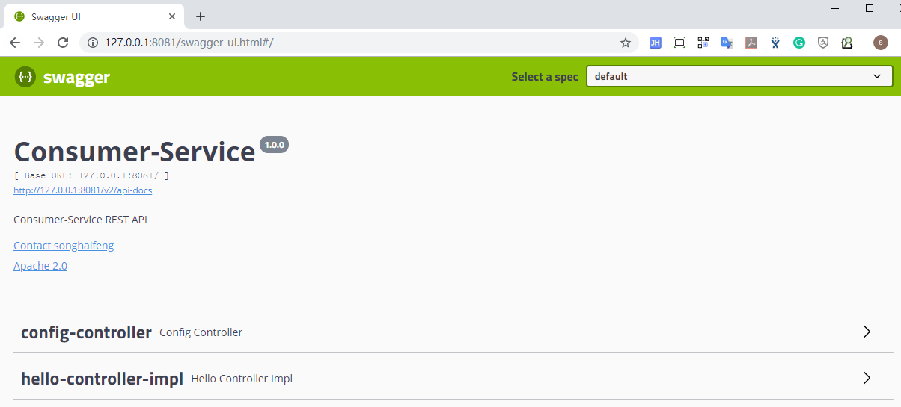
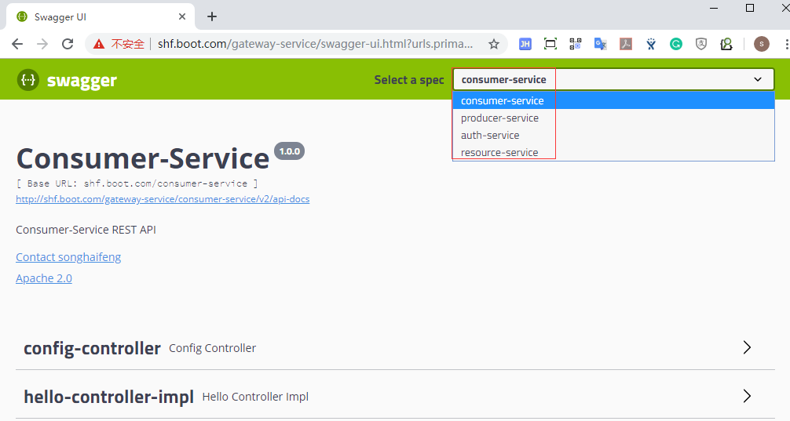

# Introduction
A spring-cloud-kubernetes sample project builds on [springboot-kubernetes-sample](https://github.com/SoulSong/springboot-kubernetes-sample) project.
Replace `spring-cloud-starter-kubernetes-ribbon` dependency with `spring-cloud-starter-netflix-ribbon`.

Current `master` branch is `kubernetes-ribbon-feign` branch.

## Difference of all branches:
- openfeign
```text
Only integrate openfeign without ribbon.
```
- ribbon-feign
```text
Integrate openfeign with spring-cloud-ribbon.
```
- kubernetes-ribbon-feign
```text
Integrate openfeign with spring-cloud-kubernetes-ribbon.
```

## Feature list:
* spring-cloud-openfeign
* spring-cloud-kubernetes-ribbon
* okHttp3
* swagger
* spring-cloud-gateway
* Custom header for api-version
* Add FeignHeaderInterceptor for throughing http-headers into the downstream service
* Aggregate all services' swagger config into gateway-service

# How To Build & Deploy
```bash
mvn clean install -P k8s
cd kubernetes && kubectl apply -f .
```
More information can forward to [REAMDE.md](https://github.com/SoulSong/springboot-kubernetes-sample/blob/master/README.md) for detail description of building&deploying and so on. 

# How To Test
## dev
### direct request consumer-service
```text
curl -H "Content-Type:application/json-v1" -H "token:123" localhost:8081/hello/call/producer-service
```

### request consumer-service by gateway-service
```text
curl -H "Content-Type:application/json-v1" -H "token:123" localhost:9999/consumer-service/hello/call/producer-service
```

## k8s
### direct request consumer-service
```text
curl -H "Content-Type:application/json-v1" -H "token:123" shf.boot.com/consumer-service/hello/call/producer-service
```

### request consumer-service by gateway-service
```text
curl -H "Content-Type:application/json-v1" -H "token:123" shf.boot.com/gateway-service/consumer-service/hello/call/producer-service
```

# How To Use Swagger
## dev
### consumer-service
```text
http://127.0.0.1:8081/swagger-ui.html
```


### producer-service
```text
http://127.0.0.1:8080/swagger-ui.html
```


## k8s
### gateway-service
Aggregate all swagger info for all services.
```text
http://shf.boot.com/gateway-service/swagger-ui.html
```

